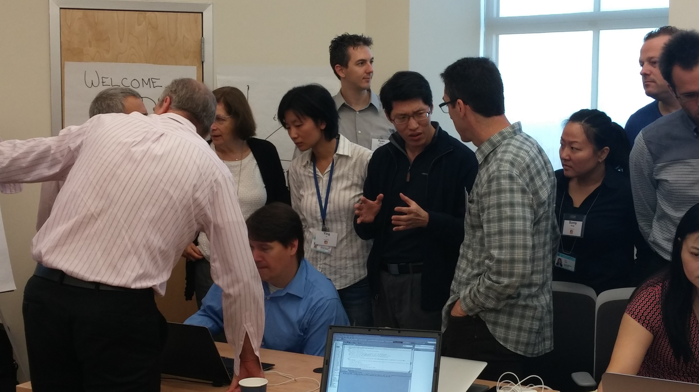
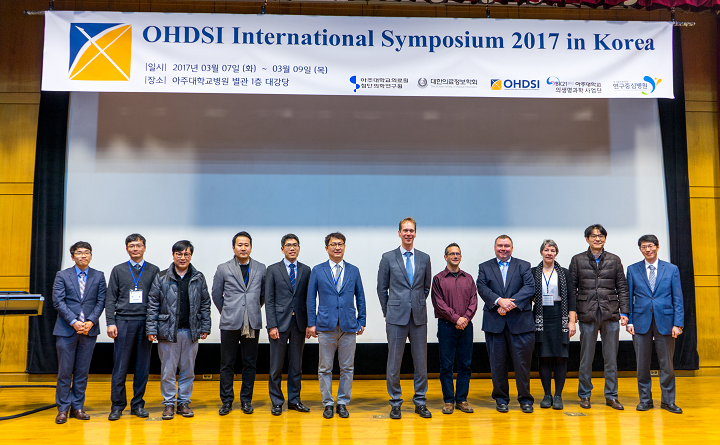
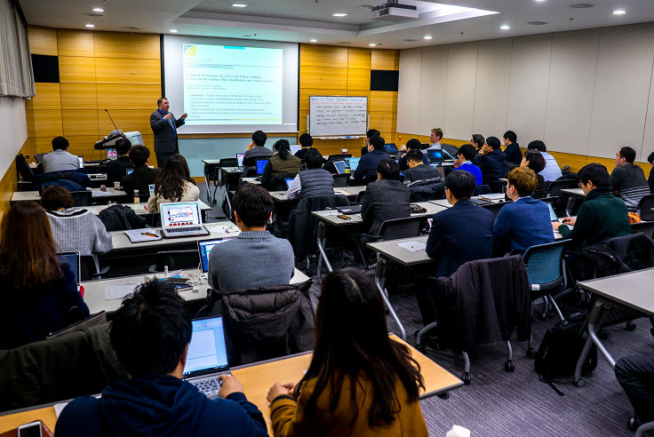

\mainmatter

# (PART) The OHDSI Community {-}

# OHDSI コミュニティ {#OhdsiCommunity}

*Chapter leads: Patrick Ryan & George Hripcsak*

> 共に歩むことがはじめの一歩、互いに寄り添うのが進歩、共に前に進むのが成功である。 -ヘンリー・フォード

## データからはじまる旅

大学病院と議員、規制機関と医療製品メーカー、保険会社や政策機関、そして患者と医療提供者との間のすべての相互関係を含む全世界の医療のどこにも、次ののような一般的な課題がある。私たちは、過去から学んだことをどのように将来のために適用して、より良い意思決定を下すことにつなげられるだろうか？

10년이 넘도록, 많은 사람들이 **learning healthcare system**의 비전에 대해서 논의해 왔다. "그것은 각 환자와 의료 제공자가 함께 의료 행위를 결정할 때 필요한 최상의 근거를 생성하고 적용하기 위함이다. 또한, 환자 치료의 부산물로서 새로운 의학적 발견이 가능하도록 유도하며, 보건의료의 혁신, 질, 안전 및 가치를 보장하기 위함이다." [@olsen2007learning] この考えは、日常診療の過程で得られた各患者のデータを分析して **real-world evidence**を作成し、それを医療システム全体に広めて臨床現場に情報を提供することができるという期待に主に基づいている。2007年、the Institute of Medicine Roundtable on Evidence-Based Medicineは、「2020年までに、臨床上の意思決定の90％は、正確で、タイムリーで、最新の臨床情報に支えられ、利用可能な最善のエビデンスを反映する」 [@olsen2007learning]という目標を設定した報告書を発表しました。様々な分野で多大な進歩があったとはいえ、私たちはまだ道半ばです。


なぜでしょうか？それは、患者レベルのデータから信頼できるエビデンスへの道のりが困難だからなのだ。データからエビデンスへの道筋は一つとして定義されているわけではなく、その道のりをナビゲートするのに役立つ地図も一つではない。実際、「データ」という単一の概念は存在しないし、「エビデンス」という単一の概念も存在しない。

```{r datajourney, fig.cap='データからはじまる旅', echo=FALSE, out.width='100%', fig.align='center'}
knitr::include_graphics("images/OhdsiCommunity/datajourney.png")
```

観察データベースには、ソースシステム内の異なる患者レベルのデータを収集するさまざまなタイプのものがある。これらのデータベースは、医療現場そのものと同様に多様であり、異なる母集団、ケアの内容、データ収集方法を反映している。また、意思決定の情報提供に有用なエビデンスの種類も様々であり、それらは、臨床情報に基づく分類、母集団レベルの効果推定、患者レベルの予測といった分析的な使用例によって分類される。起源（ソースデータ）や目的地（エビデンス）が何であるかは関係なく、この課題は、この旅を遂行するために必要とされる臨床的、科学的、技術的な能力の幅の広さによって、とても複雑になっている。患者と医療提供者の間のポイント・オブ・ケアの相互作用から、管理システムや臨床システムを経て最終的なリポジトリに至るまでのソースデータの完全な出所を含めた健康情報学の完全な理解が必要であり、健康政策やデータの収集とキュレーションのプロセスに関連する行動インセンティブの一部として生じる可能性のあるバイアスを理解する必要があります。疫学的原理と統計学的手法を熟知し、臨床的な疑問を適切な答えを出すのに適した観察研究をデザインする必要があります。何百万人もの患者と数十億人もの臨床観察データを含むデータセットに対して、計算効率の高いデータサイエンスアルゴリズムを実装し、実行する技術的能力が必要とされます。また、観察データネットワークで学んだことを他の情報源からのエビデンスと統合し、この新しい知識が医療政策や臨床にどのように影響を与えるべきかを判断する臨床的な知識も必要とされます。したがって、一人の個人がデータからエビデンスへの旅を成功させるために必要なスキルとリソースを持っていることは非常に稀である。むしろ、この旅には、複数の個人や組織が協力して、利用可能な最高のデータを最も適切な方法で分析し、すべての利害関係者が信頼し、意思決定プロセスで使用できるエビデンスを生み出すことを保証する必要があることが多い。

## OMOP (Observational Medical Outcomes Partnership)

협력 관찰형 연구 모델의 주목할만한 예시로 OMOP(Observational Medical Outcomes Partnership)이 있다. OMOP은 미국 식품의약국 FDA이 주관하고, 미국 국립 보건원 National Institutes of Health 관리하에 학술 연구자, 보건 데이터 파트너 및 협력 제약사간의 컨소시엄으로 구성되었으며, 관찰형 보건의료 데이터를 이용하여 능동적 의료 제품 안전성 감시의 발전을 꾀하고자 만들어진 민관 협력체였다. [@stang2010omop] OMOP은 다수의 이해관계자 간의 거버넌스 구조를 확립했고, 다수의 청구자료 및 전자 의무 기록 데이터베이스에 적용하여 참인 약물 안전성 연관성과 거짓 양성 소견을 식별할 수 있는 대안적인 역학 설계 및 통계 방법의 성능을 경험적으로 검증하는 일련의 방법론적 실험을 설계하였다.

集中解析と分散解析の両方の研究環境において、異種の観測データベースにまたがって研究を行う際には技術的課題がありました。そこで我々は、観測データの構造、内容、セマンティクスを標準化し、統計解析コードを一度書いたものをすべてのデータサイトで再利用できるようにするためのメカニズムとして、OMOP共通データモデル（CDM）を設計した [@overhage2012cdm] OMOPの実験では、共通のデータモデルと標準化されたボキャブラリーを確立することが可能であることが実証されました。このボキャブラリーは、異なる施設からの異なるデータに対応し、異なる共通データに基づいて表現されることで、組織間の連携と計算効率の高い分析を容易にします。

設立当初から、OMOP はオープンサイエンスのアプローチを採用し、研究デザイン、標準データ、解析コード、実証結果を含むすべての成果物を公開し、透明性を促進し、OMOP が実施している研究に対する信頼を築くだけでなく、他の研究目的を推進するために再利用可能なコミュニティリソースを提供することを目的としている。OMOP は当初、医薬品の安全性に焦点をあてていたが、OMOP CDM は継続的に進化し、医療介入の比較有効性や医療システムの政策など、分析的な利用事例の拡大をサポートするようになった。

OMOP은 대규모의 경험적 실험을 완성하는 데 성공하였고, [@ryan2012omop; @ryan2013omop] 방법론적인 혁신을 만들고, [@schuemie_2014] 관찰형 데이터를 이용한 안정성에 관련된 의사결정에 유용한 지식 생성을 위한 적절한 방법론을 제시하였다.[@madigan_2013; @madigan2013design] OMOP 프로젝트는 종료되었지만, 오픈 사이언스 원칙과 함께 OMOP의 유산은 OHDSI가 이어 받았다.

OMOP 프로젝트가 FDA의 능동 감시에 도움을 줄 수 있는 관찰형 연구를 완료하고 종료된 이후, 사람들은 OMOP 여정의 끝이 새로운 여정의 시작이 되어야 한다고 생각했다. OMOP의 방법론적 연구가 관찰형 데이터에서 생성되는 근거의 품질을 명시적으로 개선할 수 있는 모범 사례best practice를 제시하였지만, 그러한 모범 사례의 채택은 느렸다. 몇 가지 장애물들이 있었는데, 1) 방법론적인 혁신을 내세우기 전 관찰형 자료의 품질에 대한 근본적인 우려 2) 방법론적 문제와 해결책에 대한 불충분한 개념적 이해 3) 개별 데이터 파트너의 로컬 환경 내에서 솔루션을 독립적으로 구현할 수 없다는 점 4) 이러한 접근방식이 다른 연구자들이 관심을 가지고 있는 임상적 문제에 적용 가능한지에 대한 불확실성 등이었다. 이러한 모든 장애물에 대해 변화를 만들기 위해서는 한 개인의 힘이 아니라, 여러 사람이 협력하여야만 한다는 것을 깨달을 수 있었다. 다음과 같은 협력이 필요했다:

- 기초 데이터 품질에 대한 신뢰도를 높이며 구조, 콘텐츠 및 의미론적 일관성을 촉진하여 표준화된 분석이 가능하도록 개방형 커뮤니티open community의 데이터 구조, 어휘 및 추출 변환 적재Extract-Transform-Load (ETL) 표준규약 구축을 위한 협업
- 약물 안전성 연구 외에도 clinical characterization, population-level effect estimation, patient-level prediction을 위한 보다 광범위한 모범 사례를 확립하기 위한 협업. 방법론적 연구를 통해 입증된 과학적 모범 사례를 코드로 구현하고 연구자들이 쉽게 채택할 수 있는 오픈 소스 분석 소프트웨어 개발에 대한 협업
- 주요한 보건 문제를 해결할 공통의 질문에 대한 임상적용을 위한 협업으로서, 커뮤니티를 아울러서 데이터에서 근거로의 여정을 총괄적으로 인도해줄 수 있는 협업체계

このような考えからOHDSIは生まれました。


## オープンサイエンスとしてのOHDSI

Observational Health Data Sciences and Informatics（OHDSI、発音は「おっでせい」）は、より良い健康上の意思決定とより良いケアを促進するエビデンスを共同で生成するコミュニティを援助することで、健康を改善することを目的としたオープンサイエンスコミュニティである[@Hripcsak2015]。 OHDSIは、観察的な健康データを適切に使用するための科学的に最善の実践を確立するための方法論的研究を行う。そして、その実践を一貫性があり、透明性があり、再現性のあるソリューションに成文化するオープンソースの分析ソフトウェアを開発し、これらのツールとプラクティスを臨床的な質問に適用して、医療政策と患者ケアを導くことができるエビデンスを生成しています。

### OHDSIのMission

より良い健康上の意思決定とより良いケアを促進するためのエビデンスを共同で作成するために、コミュニティを支援することで、健康を改善する

> To improve health by empowering a community to collaboratively generate the evidence that promotes better health decisions and better care. \index{mission}

### OHDSIのVision

観察研究が健康と病気の総合的な理解を生み出す世界

> A world in which observational research produces a comprehensive understanding of health and disease. \index{vision}

### OHDSIの目的

* **イノベーション(Innovation)**: 観察研究は、破壊的思考から大きな利益を得ることができる分野です。私たちは積極的に新鮮な方法論的アプローチを求め、奨励しています。


> Observational research is a field which will benefit greatly from disruptive thinking. We actively seek and encourage fresh methodological approaches in our work.

* **再現性 (Reproducibility)**: 健康の向上には、正確で再現性があり、十分に調整されたエビデンスが必要です。

> Accurate, reproducible, and well-calibrated evidence is necessary for health improvement.

* **コミュニティ (Community)**: 患者であれ、医療従事者であれ、研究者であれ、あるいは単に私たちの大義を信じている人であれ、誰でも積極的にOHDSIに参加することができます。

> Everyone is welcome to actively participate in OHDSI, whether you are a patient, a health professional, a researcher, or someone who simply believes in our cause.

* **コラボレーション (Collaboration)**: コミュニティの参加者の現実世界のニーズに優先的に対処するために集団で協力します。

> We work collectively to prioritize and address the real world needs of our community’s participants.

* **公開 (Openness)**:コミュニティの収益を、私たちが生み出す方法、ツール、証拠を含めて、すべて公開し、一般にアクセスできるように努めています。

> We strive to make all our community’s proceeds open and publicly accessible, including the methods, tools and the evidence that we generate.

* **メリット (Beneficence)**: コミュニティ内の個人や組織の権利を常に保護するよう努めます。

> We seek to protect the rights of individuals and organizations within our community at all times.

\index{objectives}

## OHDSI의 역사

OHDSI는 2014년 설립된 이래 성장을 지속하여 컴퓨터 과학, 역학, 통계, 의생명 정보학, 보건 정책 및 임상 의학 등 다양한 분야를 대표하는 학계, 의료 제품 산업, 규제 기관, 정부, 보험자, 기술 제공자, 의료 시스템, 임상의사 및 환자 집단 등 2,500명 이상의 다양한 이해관계자가 온라인 포럼에서 활동하고 있다. OHDSI 협력체로써 자발적으로 보고한 기관 및 데이터베이스의 리스트는 OHDSI 웹사이트에서 확인할 수 있다. [^collaboratorUrl] OHDSI 협력자 지도 (Figure \@ref(fig:collaboratormap)) 는 폭넓은 국제 공동체로서의 다양성을 상기시킨다.

[^collaboratorUrl]: https://www.ohdsi.org/who-we-are/collaborators/

```{r collaboratormap, fig.cap='2019年9月時点でのOHDSIコラボレーラーの地図', echo=FALSE, out.width='100%', fig.align='center'}
knitr::include_graphics("images/OhdsiCommunity/mapOfCollaborators.png")
```
 OHDSI는 OMOP-CDM이라는 개방형 공동체 데이터 표준 기반으로 2019년 8월 기준으로 20여 개국, 100개 이상의 의료 데이터베이스들로 구성된 분산 연구망 distributed research network(DRN)을 구축했다. 분산 연구망이란 환자 수준의 데이터를 개인이나 조직 간에 공유할 필요가 없다는 것을 의미한다. 분산 연구망에서는, 데이터를 기관 폐쇄망 안에 두고 연구자는 프로토콜 형태의 분석 코드/프로그램을 공유한다. 데이터 파트너들은 연구자의 요청에 따라 기관 안에서 연구 프로토콜을 실행해 자동으로 생성되는 요약 집합정보 (평균, 합, 표준편차, 교차비, 위험도 등) 만 연구자에게 회신하는 방식으로, 연구자는 폐쇄망 안에 있는 환자의 개별 정보를 보거나 취득하지 않는다. OHDSI 분산망에서 각 데이터 파트너는 환자 수준 데이터의 사용에 대한 완전한 자율성을 유지하고, 각 기관의 데이터 거버넌스 정책을 지속해서 준수할 수 있다.

OHDSI 개발자 커뮤니티는 3가지의 사용 사례를 지원하기 위해 OMOP CDM 위에 다음 3가지의 강력한 오픈 소스 분석 소프트웨어 라이브러리를 구축하였는데 이는 다음과 같다. 1) 임상적 특성 분석(clinical characterization): 질병의 자연 경과, 치료 행태 및 질 향상을 위한 임상 특성 분석 2) 인구 수준 추정 (population-level effect estimation): 의약품 안전성 감시 및 비교 효과 연구에서의 인과성 분석 3) 환자 수준 예측(patient-level prediction): 기계학습 알고리즘을 활용한 정밀 의학 또는 의료 개입. OHDSI 개발자들은 OMOP CDM의 채택, 데이터 품질 평가, OHDSI 네트워크 연구의 촉진을 지원하는 애플리케이션을 개발하고 있다. 이러한 소프트웨어에는 R과 Python에 내장된 백 엔드 통계 패키지 및 HTML과 Javascript로 개발된 프론트엔드 웹 어플리케이션이 포함된다. 모든 OHDSI 소프트웨어들은 오픈 소스 정책을 채택하여 Github을 통해 공개된다. [^GitUrl]

[^GitUrl]: https://github.com/OHDSI

오픈 소스 소프트웨어들과 함께, OHDSI의 개방형 과학 공동체적 접근은 관찰형 연구의 발전을 가능하게 했다. 첫 번째 OHDSI 네트워크 연구는 당뇨, 우울증, 고혈압의 3가지 만성 질병에 대한 치료 패턴을 분석하는 것이었다. PNAS(Proceedings of the National Academy of Science)에 출판된 연구는, 그 때까지 수행된 최대 규모의 관찰형 연구로써 11개의 데이터베이스에서 2억 5천만 명의 환자 데이터를 이용하여 이전에 보고된 적 없는 치료 패턴의 지역적 차이 및 환자별 치료 선택에 대한 이질성에 대해 발표하였다. [@Hripcsak7329] OHDSI는 교란변수를 통제하는 새로운 통계적 방법론을 제시하였고, [@tian_2018] 인과성 검증 능력에 대해 검증하였고, [@schuemie_2018] 이러한 방법론을 뇌전증 약제의 개별 안전성 연구 [@duke_2017] 및 당뇨병의 이차 약제의 비교 효과 연구 [@vashisht_2018], 우울증 치료의 대규모 비교 효과 연구 [@schuemie_2018b], 고혈압 환자의 이제 병합 요법의 비교 효과 연구[@you_olmesartan_2019], 대규모 고혈압 약제 비교 연구[@suchard_comprehensive_2019] 에 활용하였다. OHDSI 공동체는 또한 관찰형 보건의료 데이터의 기계학습 알고리즘을 활용한 프레임 워크를 구축 [@reps2018] 하여 다양한 치료 분야에 활용하였다. [@johnston_2019; @cepeda_2018; @reps_2019]

## OHDSIとコラボレーション

OHDSI は、エビデンスを生み出すためのコラボレーションを強化することを目的としたコミュニティです。では、OHDSI コラボレーターになるとはどういうことでしょうか？もしあなたが OHDSI の使命を信じ、データからエビデンスへの道のりのどこかで貢献したいと考えているのであれば、OHDSI はあなたのためのコミュニティになるでしょう。コラボレーターとは、患者レベルのデータにアクセスできる個人であり、そのデータがエビデンスの生成に利用されるのを見たいと考えている人です。コラボレーターは、科学的なベストプラクティスの確立や代替アプローチの評価に関心のある研究開発者です。共同研究者は、自分のプログラミングスキルを応用して、他のコミュニティで使用できるツールを作成することに関心のあるソフトウェア開発者であることができる。共同研究者は、重要な公衆衛生上の疑問を持ち、その疑問に対するエビデンスを出版やその他の形で広く医療コミュニティに提供しようとしている臨床研究者であってもよい。コラボレーターとは、公衆衛生のためのこの共通の大義を信じ、世界中でのコミュニティ活動や研修会の開催など、コミュニティが自らを維持し、その使命を継続できるように資源を提供したいと願う個人や組織のことです。OHDSI は、分野や利害関係者の違いに関わらず、個人が共通の目的に向かって協力し、それぞれが個々の貢献をすることで、医療の発展に貢献できるような場を目指しています。この旅に参加することに興味がある方は、第 2 章（\@ref(WhereToBegin)「OHDSIはどこから始まるか」）をご覧ください。

## 한국 OHDSI의 역사 <日本の内容に書き換えをお願いいたします>
OMOP의 창립자 중 한명인 Martijn Schuemie는 OMOP의 연구성과 중 하나로서 관찰형 자료에서 confounding by indication을 찾을 수 있는 LEOPARD 알고리즘을 고안하였고, 2010년 남아프리카 케이프타운에서 열린 세계의료정보학회(IMIA)에서 그 내용을 발표하였다. 당시 세계의료정보학회에 참석하였던 박래웅은 우연히 Martijn Schuemie의 LEOPARD 알고리즘과 OMOP을 접하게 되었고 강한 흥미와 유대감을 느꼈다. 이후 그는 2012년 국내 4개 대학병원의 다기관 임상의료정보 통합시스템 개발을 진행하였고 이를 위해 자체적으로 고안한 CDM을 적용하였다. 2013년 세계약물역학학회(ICPE)가 2013년 9월 캐나타 몬트리올에서 열렸고 이 학회에서 다시 만난 Martijn Schuemie, Patrick Ryan과 박래웅은 각자 진행하던 프로젝트에 대해서 논의하였고 향후 긴밀한 협조를 결의하였다. 이후 그는 빠른시간내에 아주대병원 전자의무기록을 CDM으로 변환완료하고 2014년 OHDSI의 결성을 알리는 콜롬비아대학에서 열린 첫번째 face-to-face 모임에 참여하면서 변환완료된 아주대병원의 CDM과 Achilles 웹페이지를 전격 공개하였다. 미국 이외의 국가에서 변환된 첫번째 CDM이며 전세계에서 첫번째로 공개된 Achilles 페이지였다.

```{r OHDSIf2f2014, fig.cap='2014년 최초 개최된 OHDSI Face to Face 미팅에서 아주대학교병원의 CDM과 Achilles웹페이지를 소개하였다. 사진의 좌측하단에 Christopher Knoll이 아주대 CDM Achilles화면을 살펴보고 있으며 많은 참석자들이 각별한 관심을 보였다.', echo=FALSE, out.width='80%', fig.align='center'}

```

그는 2014년 6월 이후 본격적으로 한국사회에 OHDSI를 알리기 시작하였고, 이후 국민건강보험공단을 시작으로 가천길병원 등이 OHDSI에 참여하기 시작하였다. 이후 계속 국내외에서 OMOP-CDM, OHDSI 전파를 위해 노력한 결과, 2016년부터는 최초로 국제 OHDSI committee에서 개별 국가를 위한 포럼 [Korean chapter](http://forums.ohdsi.org/c/For-collaborators-wishing-to-communicate-in-Korean) 을 개설하고, 한국의 OHDSI 참여가 본격화 되었다. 첫 한국 국제 OHDSI 심포지엄은 2017년 3월 아주대학교에서 튜토리얼, 리더십 미팅을 포함하여 3일간 개최되었다.

```{r OHDSIInternationalSymposium2017inKorea1, fig.cap='2017년 한국에서의 OHDSI 국제 심포지엄',echo=FALSE, out.width='80%'}

knitr::include_graphics("images/OhdsiCommunity/DSC01861.png")
```

```{r OHDSIInternationalSymposium2017inKorea2, fig.cap='2017년 한국에서의 OHDSI 국제 심포지엄 튜토리얼',echo=FALSE, out.width='80%'}

```
한국 OHDSI 네트워크에 참여를 희망하는 병원 관계자들과 함께 2017년 3월 7일 첫 번째 리더십 미팅을 가진 후 현재까지 2달마다 전국의 의과대학/병원을 순회하며 총 15회 이상의 한국 OHDSI 리더십 미팅을 개최하며 OHDSI 전파 및 상호 협력을 꾀하고 있다.

## まとめ

```{block2, type='rmdsummary'}
- OHDSI の使命は、より良い健康上の意思決定とより良いケアを促進するためのエビデンスを共同生み出すコミュニティを援助することで人々の健康を改善することです。

- OHDSI のビジョンは、観察研究が健康と疾病の包括的な理解を生み出す世界であり、それはイノベーション、再現性、コミュニティ、コラボレーション、オープン性、そして利益という私たちの目標によって達成されます。

- OHDSI の共同研究者は、データからエビデンスへの道のりを改善するために、オープンコミュニティのデータ標準、方法論研究、オープンソースの分析開発、臨床応用に焦点を当てています。

```
