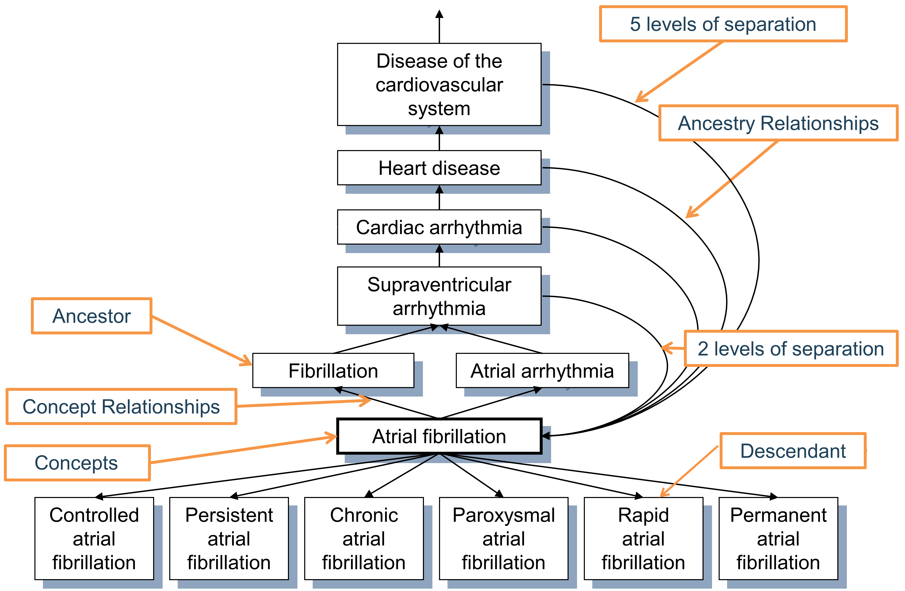

# Standardized Vocabularies {#StandardizedVocabularies}

\index{standardized vocabularies}

*Chapter leads: Christian Reich & Anna Ostropolets*

「Vocabulary」と呼ばれるOMOP標準用語集は、Common Data Model（CDM）の不可欠な要素であり、OHDSI研究ネットワークの基盤です。データの内容を定義することにより、手法、定義、結果の標準化が可能になり、ファイアウォールの内側に置かれたデータを研究ネットワークに参加させ分析対象とするための道筋を切り拓きます。通常、観察医療データの内容の検索と解釈は、それがコーディング手法を採用した構造化データであれ、フリーテキストで記述されたものであれ、臨床イベントを記述するための無数の異なる方法に直面している研究者に託されます。OHDSIでは、標準化された形式だけでなく、厳密に標準化された内容に適合させることが求められます。

この章では、まず、標準化された語彙の主要な原則、そのコンポーネント、関連するルール、規則、およびいくつかの典型的な状況について説明します。これらはすべて、この基本的なリソースを理解して利用するために必要です。また、継続的に改善するためにコミュニティのサポートが必要な場所も紹介します。

## Why Vocabularies, and Why Standardizing 

医学用語は、中世のロンドンでペストやその他の病気の発生を管理するための「Bill of Mortality」にまでさかのぼります（図参照 \@ref(fig:bill)). \index{Bill of Mortality}
  
```{r bill, fig.cap='1660年のロンドン死亡率表。当時知られていた62種類の疾患の分類システムを用いて死亡した住民の死因を示したもの',echo=FALSE, out.width='100%', fig.align='center'}
knitr::include_graphics("images/StandardizedVocabularies/bill.jpg")
```  
  
以来、分類の規模と複雑さは大幅に拡大し、処置や診療行為、医薬品、医療機器など医療分野における他領域にも広がっています。ただし主な原則は変わっていません。患者データの収集、分類、分析を目的として、一部の医療コミュニティが合意して管理する語彙、用語、階層、またはオントロジーであるということです。用語集の多くは、長期的な権限を持つ公的機関や政府機関によって維持されています。例えば、世界保健機関（WHO）は、国際疾病分類（ICD）を作成しており、最近では第 11 版（ICD11）が追加されました。各国は、ICD10CM（米国）、ICD10GM（ドイツ）などの国別のローカルバージョンを作成しています。また、政府は医薬品の市場と販売を管理し、認証を受けた医薬品の国立のリポジトリを維持しています。また、民間においても、商用製品や電子カルテ（EHR）システムや医療保険請求報告などの内部使用のために、用語集が使用されています。

結果的に、それぞれの国、地域、医療システム、医療機関が独自の用語集を持っている傾向があり、その用語集で適用されている分類は使用されている場所のみで使われている可能性が高いです。このような無数の用語集が、システムの相互運用性を妨げています。標準化は、患者データの交換を可能にし、グローバルレベルでの健康データ分析を可能にし、診療行為の分析や品質評価に関して体系的で標準化された研究を可能にする鍵である。この問題に対処するために、上記のWHOやSNOMED（Standard Nomenclature of Medicine）やLOINC（Logical Observation Identifiers Names and Codes）のように、多国籍の組織が立ち上がり、幅広い標準規格を作り始めています。 米国では、Health IT Standards Committee（HITAC）がSNOMED、LOINC、医薬品用語集RxNormを標準規格として使用することを全米健康ITコーディネータ（ONC）に勧告して、多様な主体間の健康情報交換のための全国共通プラットフォームでの使用を推奨しています。

OHDSI は、観測研究の世界標準であるOMOP CDMを開発しました。CDMの一部として、OMOP標準用語集は主に2つの目的で利用できます。

- コミュニティで使用されているすべての用語の共通リポジトリ
- 研究に利用するための標準化とマッピング

標準化された用語集はコミュニティに無料で提供されており、OMOP CDMインスタンスには***必須の参照表( mandatory reference table)として使用する必要**があります。


### Building the Standardized Vocabularies

標準用語集のすべての用語は、共通のフォーマットに統合されています。これにより、研究者は元の用語集の複数の異なるフォーマットやライフサイクルの慣習を理解して扱う必要がなくなります。すべての用語集は定期的に更新され、Pallasシステムを使用して組み込まれています[^pallasUrl]。間違いを見つけた場合は、OHDSI Forums[^forums2Url]またはCDM Github[^cdmIssuesUrl]ページに投稿して、このリソースの改善に役立ててください。\index{Pallas system}

[^pallasUrl]: https://github.com/OHDSI/Vocabulary-v5.0
[^forums2Url]: https://forums.ohdsi.org
[^cdmIssuesUrl]: https://github.com/OHDSI/CommonDataModel/issues

### Access to the Standardized Vocabularies {#accessVocabularies}

標準化された用語集を取得するためには、Pallasを自分で起動する必要はありません。その代わりに、ATHENA[^athenaUrl]から最新版をダウンロードして、ローカルデータベースにロードすることができます。ATHENAは用語集のファセット検索もできます。\index{ATHENA} \index{standardized vocabularies!download} \index{standardized vocabularies!search}

[^athenaUrl]: http://athena.ohdsi.org

すべての標準用語集の表を含むzip ファイルをダウンロードするにあたり、OMOP CDM に必要なすべての語彙を選択してください。標準概念（セクション\@ref(standardConcepts)参照）と非常に一般的な使用法を持つ用語は既定で選択されています。ソースデータで使用されている用語集を追加してください。プロプライエタリな用語集には選択ボタンは表示されません。そのような用語集をリストに組み込むには、「License required」ボタンをクリックしてください。Vocabulary Team から連絡があり、ライセンスの確認やライセンス取得のためのサポートを依頼することができます。

### Source of Vocabularies: Adopt Versus Build

OHDSI は一般的に、(i)多くの用語集が既にコミュニティの観察データに利用されていること、(ii)用語集の構築と維持は複雑であり、成熟するまでに長い期間をかけて多くの利害関係者の意見を必要とするため、一から構築するよりも既存の用語集を採用することを選びました。専門組織が提供する用語集は、生成、非推奨、マージ、分割というライフサイクルを経ています（セクション \@ref(conceptLifeCycle)）。現在のところ、OHDSI は、型概念(Type Concepts)（例えば、症状型概念）のような内部管理用用語集のみを作成しています。唯一の例外は、米国外でのみ使用される薬剤をカバーする語彙であるRxNorm Extensionです（セクション\@ref(rxNormExtension)参照）。

## Concepts

OMOP CDM のすべての臨床イベントは概念(Concept)を使って表現されます。これらの概念は各イベントの意味的な概念を表します。これらはデータレコードの基本的な構成要素であり、テーブルは少数の例外を除いて完全に正規化されています。概念は CONCEPT テーブルに格納されます (図参照\@ref(fig:concept))。\index{concept}
  
```{r concept, fig.cap='OMOP CDMにおける用語の概念の標準的表現。この例は、心房細動のSNOMEDコードに対応するCONCEPTテーブルのレコードです。',echo=FALSE, out.width='90%', fig.align='center'}
knitr::include_graphics("images/StandardizedVocabularies/concept.png")
```  

この体系は、**包括的**であることを意図しています。すなわち、患者の健康管理に関連するあらゆる事象（例えば、状態、処置、薬剤への曝露など）をカバーするのに十分な概念があるだけでなく、医療情報システムの管理情報の一部（例えば、来院、治療場所など）をカバーするのに十分な概念があります。

### Concept IDs

各概念には、主キーとして使用する概念ID(concept ID)が割り当てられています。IDは意味を持たない整数値であり、元の用語集におけるコードではありません。概念IDはCDMイベントテーブルにデータを記録するために使用されます。 \index{concept!identifier}

### Concept Names

それぞれの概念には一つの名前がついています。名前は常に英語です。それらは用語のソースからインポートされます。元の用語に複数の名前がある場合、最も表現力の高いものが選択され、残りの名前は同じCONCEPT_IDキーの下にCONCEPT_SYNONYMテーブルに保存されます。英語以外の名前も同様にCONCEPT_SYNONYMに記録され、LANGUAGE_CONCEPT_IDフィールドに適切な言語概念IDが割り当てられます。名前の長さは255文字で、非常に長い名前は切り捨てられ、完全な長さのものは1000文字までの別のシノニムとして記録されます。

### Domains {#conceptDomains}

各概念は、DOMAIN_IDフィールドにドメインが割り当てられます。DOMAIN_IDは、数値のCONCEPT_IDとは対照的に、ドメインのための短い大文字小文字を区別するユニークな英数字のIDです。このようなドメイン識別子の例として、"Condition"、"Drug"、"Procedure"、"Visit"、"Device"、"Specimen "などがあります。曖昧な概念又は事前に調整された（組み合わせた）概念は、組み合わせドメインに属することができるが、標準概念（セクション\@ref(standardConcepts)参照）には、常に単一ドメインが割り当てられます。ドメインはまた、臨床事象や事象属性がどの CDM テーブルやフィールドに記録されるかを指示します。
ドメインの割り当ては、OMOP固有の機能として、[Pallas](https://github.com/ohDSI/vocabulary-v5.0)で示されているヒューリスティックな手法を用いて、用語の取り込み中に行われます。ソース用語集は、程度の差はあれ、複数のドメインのコードを組み合わせることがあります(図\@ref(fig:domains))。\index{domain!concept}

```{r domains, fig.cap='DPT4とHCPCSの処置用語集におけるドメインの割り当て。直感的には、これらの用語集には単一のドメインのコードと概念が含まれているはずですが、実際には混在しています.
',echo=FALSE, out.width='70%', fig.align='center'}
knitr::include_graphics("images/StandardizedVocabularies/domains.png")
```  

ドメインのヒューリスティックはドメインの定義に従います。これらの定義は、CDMのテーブルとフィールドの定義から導き出されます(Chapter \@ref(CommonDataModel)を参照)。ヒューリスティックは完全ではありません。グレーゾーンがあります(セクション\@ref(specialSituations) "Special Situations "を参照)。概念ドメインの割り当てが間違っているのを見つけた場合は、[Forums](https://forums.ohdsi.org) または [CDM issue](https://github.com/OHDSI/CommonDataModel/issues) に投稿して、プロセスを改善するために報告してください。

### Vocabularies

各用語集のIDは、用語集の略称の後に続く短い大文字小文字を区別するユニークな英数字のIDを持ち、ダッシュは省略されています。例えば、ICD-9-CMは "ICD9CM "という用語IDを持っています。現在OHDSIがサポートしている用語集は111種類で、そのうち78種類は外部からの採用であり、残りはOMOPの内部用語集です。これらの用語集は通常、四半期ごとに更新されます。これらの用語集の出典とバージョンは、VOCABULARY参照ファイルで定義されています。\index{vocabulary}.

### Concept Classes

一部の用語集では、コードや概念を分類しており、大文字小文字を区別するユニークな英数字のIDで示されている。例えば、SNOMEDには臨床所見、社会的背景、身体構造などの33の概念クラスがあり、SNOMEDでは「意味タグ(semantic tags)」と呼んでいます。これらは概念群を縦割りで分類するものです。MedDRAやRxNormのような概念クラスは、階層化された階層の中で水平方向に分類しています。HCPCS のように概念クラスを持たない用語は、用語ID を概念クラスIDとみなします。\index{concept!class}

Table: (\#tab:sublassification) 概念クラスにおける分類手法

|Concept class subdivision principle |	Vocabulary
|:-------- |:----------------------------------
|Horizontal | 全ての医薬品の用語集, ATC, CDТ, Episode, HCPCS, HemOnc, ICDs, MedDRA, OSM, Census 
|Vertical | CIEL, HES Specialty, ICDO3, MeSH, NAACCR, NDFRT, OPCS4, PCORNET, Plan, PPI, Provider, SNOMED, SPL, UCUM 
|Mixed | CPT4, ISBT, LOINC
|None | APC, all Type Concepts, Ethnicity, OXMIS, Race, Revenue Code, Sponsor, Supplier, UB04s, Visit    

水平に分類される概念クラスでは、特定の階層レベルを決定することができます。例えば、医薬品の用語集であるRxNormでは、概念クラス" Ingredient "は階層の最上位レベルを定義します。垂直分類モデルでは、概念クラスのメンバーは、上から下までの任意の階層レベルを持つことができます。

### Standard Concepts {#standardConcepts}

各々の臨床事象に関して、（候補としての数ある概念の中から）一つの概念が標準概念として選ばれます。例えば、MESHコードD001281、CIELコード148203、SNOMEDコード49436004、ICD9CMコード427.31、ReadコードG573000は、すべて症状ドメインにおいて「心房細動」を定義していますが、SNOMEDの概念だけが標準概念として採用され、データの中で症状を表すのに使われます。他の概念は非標準概念またはソース概念とされ、標準概念へマッピングされます。標準概念は、STANDARD_CONCEPTフィールドの "S "によって示されます。そして、"_CONCEPT_ID "で終わるCDMフィールドにデータを記録するためには、これらの標準概念のみが使用されます。\index{standard concept}

### Non-Standard Concepts

非標準概念は臨床事象の表現には使用されないが、標準化語彙の一部であることに変わりはなく、またソースデータに多く見られます。そのため、「ソース概念(source concepts)」とも呼ばれます。ソース概念の標準概念への変換は、「マッピング」と呼ばれるプロセスです（セクション\@ref(conceptMapping)参照）。STANDARD_CONCEPTフィールドでは、非標準概念には値がありません（NULL）。

### Classification Concepts

これらの概念は標準概念ではないので、データを表現するために使用することはできません。しかし、これらの概念は標準概念と一緒に階層を構成していますので、階層的なクエリを実行するために使用できます。例えば、MedDRA コード 10037908 の全ての子孫（MedDRA ライセンスを取得していないユーザーには表示されません。アクセス制限についてはセクション　\@ref(accessVocabularies)を確認下さい。）は、心房細動のための標準的なSNOMEDコンセプトを取得します（CONCEPT_ANCESTORテーブルを使用した階層的なクエリについては、セクション\@ref(conceptAncestor)を参照してください） - Figure ＠ref(fig:hierarchy)を参照してください。\index{classification concept}

```{r hierarchy, fig.cap='症状ドメインにおける標準概念、非標準概念またソース概念、および分類概念とその階層的な関係について。ほとんどの標準的な症状概念にはSNOMEDが使用されます（ICDO3に由来するいくつかの腫瘍関連概念を含む）。階層的な分類概念にはMedDRAの概念が使用されます。他のすべての用語集には階層に参加しない非標準またはソース概念が含まれている。',echo=FALSE, out.width='100%', fig.align='center'}
knitr::include_graphics("images/StandardizedVocabularies/hierarchy.png")
```  

標準概念、非標準概念、分類概念の選択は、通常、用語集レベルで各ドメインごとに個別に行われます。これは、概念の質、組み込まれている階層、用語が定義された目的に基づいて行われます。また、用語のすべての概念が標準概念として使用されるわけではありません。概念の指定はドメインごとに分かれていて、それぞれの概念はアクティブでなければならず（セクション\@ref(conceptLifeCycle)参照）、異なる用語集における複数の概念が同じ意味で競合している場合には、優先順位があるかもしれません。つまり、「標準用語集」というものは存在しないのです。例としては、表の\@ref(tab:vocabList)を参照してください。

Table: (\#tab:vocabList) 標準/非標準/分類 概念の割り当てに使用される用語のリスト 

|Domain | 標準概念への使用 | ソース概念への使用 | 分類概念への使用
|:-------- |:--------------- |:--------------- |:-------------
|Condition | SNOMED, ICDO3 | SNOMED Veterinary | MedDRA
|Procedure | SNOMED, CPT4, HCPCS, ICD10PCS, ICD9Proc, OPCS4 | SNOMED Veterinary, HemOnc, NAACCR | None at this point
|Measurement | SNOMED, LOINC | SNOMED Veterinary, NAACCR, CPT4, HCPCS, OPCS4, PPI | None at this point
|Drug | RxNorm, RxNorm Extension, CVX | HCPCS, CPT4, HemOnc, NAAACCR | ATC
|Device | SNOMED | Others, currently not normalized | None at this point
|Observation | SNOMED | Others | None at this point
|Visit | CMS Place of Service, ABMT, NUCC | SNOMED, HCPCS, CPT4, UB04 | None at this point

### Concept Codes

ICD9CMやNDCコードはこのフィールドに格納されるが、OMOPテーブルはCONCEPTテーブルへの外部キーとして概念IDを使用する。その理由は、名前空間が用語集間で重複していること、すなわち、同じコードが全く異なる意味を持つ異なる用語集に存在する可能性があるからである（表参照：表 \@ref(tab:code1001) \index{concept!code}

Table: (\#tab:code1001) 同一の概念コード1001を持つが、用語集、ドメイン、概念クラスが異なる概念

|概念ID | 概念コード | 概念名称 | ドメインID | 用語集ID | 概念クラス
|:--------- |:---- |:------------ |:---------- |:---------- |:---------- 
|35803438 | 1001 | Granulocyte colony-stimulating factors | Drug | HemOnc | Component Class
|35942070 | 1001 | AJCC TNM Clin T | Measurement | NAACCR | NAACCR Variable
|1036059 | 1001 | Antipyrine | Drug | RxNorm | Ingredient
|38003544 | 1001 | Residential Treatment - Psychiatric | Revenue Code | Revenue Code | Revenue Code
|43228317 | 1001 | Aceprometazine maleate | Drug | BDPM | Ingredient
|45417187 | 1001 | Brompheniramine Maleate, 10 mg/mL injectable solution | Drug | Multum | Multum
|45912144 | 1001 | Serum | Specimen | CIEL | Specimen

### Life-Cycle {#conceptLifeCycle}

Vocabularies are rarely permanent corpora with a fixed set of codes. Instead, codes and concepts are added and get deprecated. The OMOP CDM is a model to support longitudinal patient data, which means it needs to support concepts that were used in the past and might no longer be active, as well as supporting new concepts and placing them into context. There are three fields in the CONCEPT table that describe the possible life-cycle statuses: VALID_START_DATE, VALID_END_DATE, and INVALID_REASON. Their values differ depending on the concept life-cycle status:

用語集は、固定されたコードのセットを持つ永続的なコーパスであることはほとんどありません。その代わり、コードや概念は追加され、古いものは非推奨となります。OMOP CDMは縦断的な患者データをサポートするためのモデルであり、過去に使用されていた概念もサポートする必要があります。そして、新しい概念をサポートし、これまでのデータに対して適用する必要があることを意味しています。CONCEPTテーブルには、ライフサイクル・ステータスを記述する3つのフィールドがあります。VALID_START_DATE、VALID_END_DATE、INVALID_REASONです。これらの値は、概念のライフサイクル・ステータスによって変わります。

- **Active or new concept**
	- 説明: 現在使用されている
	- VALID_START_DATE: 概念のインスタンスが作成された日。用語集に当該概念が組み込まれた日が不明な場合は、1970-1-1を指定します。
	- VALID_END_DATE: 未定義の未来には無効になるかもしれないが、今は有効である "ことを示す慣例として、2099-12-31に設定します。
	- INVALID_REASON: NULL
- **Deprecated Concept with no successor**
	- 説明:  概念は非アクティブであり、標準概念として使用することはできません(セクション\@ref(standardConcepts)参照).
	- VALID_START_DATE: 概念のインスタンスが作成された日。用語集に当該概念が組み込まれた日が不明な場合は、1970-1-1を指定します。
	- VALID_END_DATE:  非推奨になった過去の日、不明な場合は用語集から当該概念が削除された、あるいは非アクティブに設定された時の用語集の更新日
	- INVALID_REASON: "D"
- **Upgraded Concept with successor**
	- 説明: 概念は非アクティブですが、後継者が定義されています。これらは典型的には重複排除が行われた概念です。
	- VALID_START_DATE: 概念のインスタンスが作成された日。用語集に当該概念が組み込まれた日が不明な場合は、1970-1-1を指定します。
	- VALID_END_DATE: アップグレードがあった過去の日付。不明な場合は当該概念がアップグレードされた概念が含まれた時の用語集の更新日
	- INVALID_REASON: "U"
- **Reused code for another new concept**
	- 説明: この用語はこの非推奨概念の概念コードを新しい概念に再利用しました。
	- VALID_START_DATE: 概念のインスタンスが作成された日。用語集に当該概念が組み込まれた日が不明な場合は、1970-1-1を指定します。
	- VALID_END_DATE: 非推奨となった過去の日付。不明な場合は当該概念が削除されたか非アクティブに設定されたときの用語集の更新日
	- INVALID_REASON: "R"

一般に、概念コードは再利用されることはありません。しかし、この規則から逸脱したいくつかの用語集、特に HCPCS、NDC 及び DRG がある。これらの用語集では、同じ概念コードが同じ用語集の複数の概念に現れます。それらのCONCEPT_ID値は一意のままです。これらの再利用された概念コードはINVALID_REASONフィールドに "R "でマークされ、VALID_START_DATEからVALID_END_DATEまでの期間は、同じ概念コードを持つ概念から区別されるようにするべきです。

## Relationships

とある2つの概念間において、2つの概念が同じドメインや用語集に属するかどうかに関係なく、関係を定義することができます。関係の性質は、CONCEPT_RELATIONSHIPテーブルのRELATIONSHIP_IDフィールドの短い大文字小文字を区別するユニークな英数字IDで指定されます。関係性は対称性があります。すなわち、各関係性に対して、CONCEPT_ID_1とCONCEPT_ID_2のフィールドの内容が入れ替わり、RELATIONSHIP_IDは反対の関係性のものにセットされます。例えば、"Maps to "関係性で定義された2つの概念は、順番を入れ替えて反対の関係性である "Mapped from "で定義されます。\index{concept!relationship}
 
 CONCEPT_RELATIONSHIPテーブルのレコードは、ライフサイクルのフィールドであるRELATIONSHIP_START_DATE、RELATIONSHIP_END_DATE、INVALID_REASONも持っています。しかし、ATHENAを通じて利用できるのは、INVALID_REASON = NULLを持つアクティブなレコードのみです。非アクティブな関係性は内部処理のためだけにPallasシステムに保持されます。RELATIONSHIPテーブルは、関係性IDの完全なリストとその逆の対応を持つリファレンスとして機能します。

### Mapping Relationships {#conceptMapping}

これらの関係性は、非標準概念から標準概念へのマッピングを提供し、2つの関係性IDのペアでサポートされています(表 \@ref(tab:mappingRelationships) 参照)。\index{concept!mapping}

Table: (\#tab:mappingRelationships) マッピング関係性の種類

|関係性IDペア | 目的
|:------------- | :----------------------------------------------------
|"Maps to" and "Mapped from" | 標準概念はそれ自身に、非標準概念は標準概念にマッピングされます。ほとんどの非標準概念とすべての標準概念は、標準概念とこの関係を持っています。前者は*_SOURCE_CONCEPT_IDフィールドに、後者は*_CONCEPT_IDフィールドに格納されます。分類概念はマッピングされません。
|"Maps to value" and "Value mapped from" | MEASUREMENTテーブルおよびOBSERVATIONテーブルのVALUE_AS_CONCEPT_IDフィールドに配置される値を表す概念へのマッピング。
	

これらのマッピング関係性の目的は、OMOP CDM における臨床イベントの表現方法を調和させるために、等価な概念間のクロスウォークを可能にすることです。これは標準化用語集の主な成果です。

"等価な概念 "とは、同じ意味を持つということです。重要なことは、階層的な子孫が同じ意味空間をカバーしていることを意味するということです。等価な概念が利用できず、その概念が標準化されていない場合でも、、少し広い概念にマッピング（いわゆる"up-hill"マッピング」）されます。例えば、ICD10CM W61.51 "Bitten by goose （ガチョウに噛まれた）"は、標準状態概念において一般的に使用されるSNOMED統制用語集には等価なものがありません。その代わりに、SNOMED 217716004 "Peck by bird (鳥につつかれた)"にマッピングされ、その鳥がガチョウであるという文脈が失われます。このような情報の損失が、標準的な研究のユースケースとは無関係であると考えられる場合にのみ、"up-hill"マッピングが使用されます。

いくつかのマッピングは、ソース概念を複数の標準概念に接続します。例えば、ICD9CM 070.43 "Hepatitis E with hepatic coma (肝性昏睡を伴うE型肝炎)"は、SNOMED 235867002 "Acute hepatitis E (急性E型肝炎)"とSNOMED 72836002 "Hepatic Coma (肝性昏睡)"の両方にマッピングされています。その理由は、元々のソース概念が、肝炎と昏睡という2つの症状がプリコーディネートされた組み合わせだからです。SNOMED にはその組み合わせがないため、ICD9CM レコードには 2 つのレコードが書き込まれ、それぞれにマッピングされた標準概念が 1 つずつ書き込まれることになります。

関係性 "値へのマップ("Maps to value") "は、実体-属性-値（EAV）モデルに従ったOMOP CDMテーブルの値の分割を目的としている。これは、以下のような状況で適用されます

- 検査と結果値から構成される検査結果
- 個人または家族の病歴
- 物質へのアレルギー
- 予防接種の必要性

これらの状況では、ソース概念は、属性（検査または履歴）と値（検査結果または疾患）の組み合わせです。ソース概念は、Maps to"関係によって属性概念に、"Maps to value"関係によって値概念にマッピングされます。例として図の\@ref(fig:conceptValue)を参照してください。

```{r conceptValue, fig.cap='ソース概念と標準概念の間の一対多のマッピング。プリコーディネートされた概念は2つの概念に分割され、1つは属性(ここでは臨床所見の履歴)で、もう1つは値(消化性潰瘍)です。"Maps to"関係は測定ドメインや観察ドメインの概念にマッピングしますが、"Maps to value"概念にはドメインの制限はありません。',echo=FALSE, out.width='100%', fig.align='center'}
knitr::include_graphics("images/StandardizedVocabularies/conceptValue.png")
```  

概念のマッピングは、無料で提供される OMOP標準用語集の中心的な機能の一つであり、ネットワーク研究を行うコミュニティの取り組みを支援しています。関係性のマッピングは外部のソースから導き出されたものであるか、用語集のチームが手動で管理しています。完全とは言えませんので、間違った関係性のマッピングを発見した場合、[フォーラム] (https://forums.ohdsi.org) や [CDM issue] (https://github.com/OHDSI/CommonDataModel/issues) に投稿して、プロセスを改善するための手助けをしてください。

マッピングの規約についてのより詳細な説明は OHDSI Wiki にあります。[^vocabMappingUrl]

[^vocabMappingUrl]: https://www.ohdsi.org/web/wiki/doku.php?id=documentation:vocabulary:mapping

### Hierarchical Relationships

階層を示す関係は、"Is a"-"Subsumes"の関係性ペアによって定義されます。階層関係は、子概念が親概念のすべての属性に加えて、1 つ以上の追加属性またはより正確に定義された属性を持つように定義されます。例えば、SNOMED 49436004「心房細動」は、SNOMED 17366009「心房性不整脈」と「Is a」の関係で関連しています。両方の概念は、不整脈のタイプを除き、同じ属性を持っています。概念は、複数の親概念と複数の子概念を持つことができます。この例では、SNOMED 49436004 「心房細動」は、SNOMED 40593004 「細動」に対する "Is a "でもあります。\index{concept!hierarchy}

### Relationships Between Concepts of Different Vocabularies

これらの関係は一般的に「用語A- 用語Bは同等である」というタイプのもので、原典の用語集から定義を提供されるか、OHDSI用語集チームが作成したものです。これらは近似的なマッピングの役割を果たしますが、多くの場合、より正確な関係性のマッピングよりも精度が低いことがあります。高品質の等価関係（例:"Source - RxNorm equivalent"）は常に"Maps to"関係として取り入れられます。

### Relationships Between Concepts of the Same Vocabulary

内部の用語の関係性は、通常、用語集の提供者が提供しています。完全な説明は、OHDSI Wikiの個々の用語集に関するエントリーにある用語集のドキュメントを参照してください。[^vocabVocabulariesUrl]

[^vocabVocabulariesUrl]: https://www.ohdsi.org/web/wiki/doku.php?id=documentation:vocabulary

多くは臨床事象間の関係を定義しており，情報検索に利用できます．例えば、尿道の障害は、"Finding site of "の関係を辿ることで見つけることができます（表\@ref(tab:findingSite)参照）。

Table: (\#tab:findingSite) "Finding site of" relationship of "Urethra "の関係は、この解剖学的構造の中に全ての疾患が存在することを示しています

|CONCEPT_ID_1 | CONCEPT_ID_2
|:---------------- | :----------------------------
|4000504 "尿道部" | 36713433 "尿道の部分重複"
|4000504 "尿道部" | 433583 "尿道上裂"
|4000504 "尿道部" | 443533 "尿道上裂, 男性"
|4000504 "尿道部" | 4005956 "尿道上裂, 女性"
	
これらの関係性の定義の質や網羅性は、元の用語集の質によって異なります。一般的には、SNOMEDのように標準概念として利用するために使用されている用語集は、キュレーションが良いという理由で選ばれているため、内部の関係性の定義の質も高い傾向にあります。


## Hierarchy {#conceptAncestor}

ドメイン内では、標準概念と分類概念は階層構造に編成され、CONCEPT_ANCESTORテーブルに格納されます。これにより、概念とそのすべての階層的な子孫を検索したり、取得したりすることができます。これらの子孫は、その祖先と同じ属性を持っていますが、追加の属性や定義された属性も持っています。

CONCEPT_ANCESTORテーブルは、CONCEPT_RELATIONSHIPテーブルから自動的に構築され、階層的な関係を介して接続されたすべての可能な概念を網羅します。これらは、"Is a" - "Subsumes "のペア（図\@ref(fig:conceptAncestor)参照）や、用語集を越えて階層的に接続された他の関係です。関係性が階層構造に参加するかどうかの選択は、各関係性IDについて、RELATIONSHIP参照テーブルのフラグDEFINES_ANCESTRYによって定義されます。

(ref:foo) 症状 "心房細動 "の階層。第一親等の先祖関係は "Is a "と "Subsumes "の関係によって定義され、すべての高次の関係は推論され、CONCEPT_ANCESTORテーブルに格納される。各概念は、両方のレベルの分離が0に等しい、それ自身の子孫でもあります。 \index{concept!ancestor}   
  
```{r conceptAncestor, fig.cap='(ref:foo)', echo=FALSE, out.width='100%', fig.align='center'}

```  

先祖の程度、つまり祖先と子孫の間のステップ数は、MIN_LEVELS_OF_SEPARATIONフィールドとMAX_LEVELS_OF_SEPARATIONフィールドで捕捉され、可能な限り最短または最長の接続を定義します。すべての階層関係が、分離レベルの計算に等しく寄与するわけではありません。程度のためにカウントされるステップは、各リレーションシップIDのRELATIONSHIP参照テーブルのIS_HIERARCHICALフラグによって決定されます。

現時点では、高品質な包括的階層が存在するのは、薬剤と状態の2つのドメインのみです。処置、検査、観察のドメインは部分的にしかカバーされておらず、構築中です。祖先に関する情報(ancestry)は、原産国、ブランド名、または他の属性に関係なく、与えられた成分を持つすべての薬剤または薬剤クラスのメンバーを閲覧できるので、薬剤ドメインでは特に有用です。

## Internal Reference Tables

DOMAIN_ID、VOCABULARY_ID、CONCEPT_CLASS_ID(すべてCONCEPTレコード内)、CONCEPT_RELATIONSHIP_ID(CONCEPT_RELATIONSHIP内)はすべて独自の用語によって制御されます。これらは4つの参照テーブル DOMAIN, VOCABULARY, CONCEPT_CLASS, RELATIONSHIPで定義されており、主キーとしての*_IDフィールド、より詳細な*_NAMEフィールド、および参照テーブルレコードのそれぞれの概念を含むCONCEPTテーブルへの参照を持つ*_CONCEPT_IDフィールドを含んでいます。これらの重複レコードの目的は、自動ナビゲーション・エンジンを可能にする情報モデルをサポートすることにあります。

また、VOCABULARYテーブルは、元の用語のソースとバージョンを参照するVOCABULARY_REFERENCEおよびVOCABULARY_VERSIONフィールドを含みます。RELATIONSHIPテーブルは、追加のフィールドDEFINES_ANCESTRY、IS_HIERARCHICAL、およびREVERSE_RELATIONSHIP_IDを有します。後者は、関係性のペアの反対の関係性を定義する関係性IDを定義します。

## Special Situations {#specialSituations}

### Gender

OMOP CDM および標準用語集における性別は、出生時の生物学的性別を示す。しばしば、代替的な性別をどのように定義するかという質問が出てくる。これらのユースケースは、OBSERVATION テーブルのレコードでカバーしなければならず、（データ資産にそのような情報が含まれている場合には）人の自己定義の性別が格納される。

### Race and Ethnicity

これらは、米国政府の定義に従っています。民族とは、ヒスパニック系か非ヒスパニック系かの区別であり、どのような人種でもよいです。人種は主な5つの上位人種で区分され、その階層的な子孫として民族を持つ。いわゆるハーフは含まれない。

### Diagnostic Coding Schemes and OMOP Conditions

ICD-9やICD-10のような一般的に使用されているコーディングスキームは、適切な診断ワークアップに基づいて、それなりに確定された診断群を定義しています。状態ドメインは、この意味空間と同一というわけではなく、部分的に重複しています。例えば、状態ドメインには、診断が導出される前に記録される徴候や症状も含まれておりますし、ICDコードには他のドメイン（例えば、処置）に属する概念が含まれていたりします。

### Procedure Coding Systems

同様に、HCPCSやCPT4のようなコーディングスキームは、医療処置のリストと考えられています。実際には、これらは医療サービスの支払いを正当化するためのメニューのようなものです。これらのサービスの多くは手技の領域に含まれていますが、多くの概念はこの領域から外れています。

### Devices

デバイスの概念には、標準概念のソースに使用できる標準化されたコーディングスキームがありません。多くのソースデータでは、デバイスはコード化されていないか、外部コーディングスキームにすら含まれていません。同様に、現在利用可能な階層体系はありません。

### Visits and Services

来院(Visits)の概念は、医療機関における受療を定義する。多くのソースシステムでは、「医療サービスの提供場所」と呼ばれ、病院などの組織や物理的な構造物を意味する。他のシステムでは、サービスと呼ばれることもある。これらも国によって異なり、統一された定義を得るのは困難である。診療施設(Care site)は、多くの場合、数回来院した施設に集約させる（XYZ病院）が、それでも、それによって定義されるべきではない（XYZ病院の患者であっても、患者は当該病院外で受診することがあるかもしれない）。

### Providers and Specialties

医療従事者のドメインでは、あらゆる（人間の）医療従事者が定義されている。これらは、医師や看護師のような医療専門家だけでなく、検眼士や靴屋のような非医療専門家であってもよい。専門分野は、医療従事者である "Physician "の子孫である。診療施設は、主流を占める（例えば「外科部門」）の専門性によって定義されていることが多いが、専門性を持つことはできない。


### Therapeutic Areas With Special Requirements

標準化された用語集は、医療のあらゆる側面を包括的にカバーしています。しかし、一部の治療分野では特別なニーズがあり、特別な用語集が必要とされています。例として、腫瘍学、放射線学、ゲノミクスなどが挙げられます。特別な OHDSI ワーキンググループがこれらの拡張機能を開発しています。その結果、OMOP 標準語用語集は統合されたシステムを構成しており、異なる起源と目的を持つ概念がすべて同じドメイン固有の階層に存在しています。

### Standard Concepts in the Drug Domain {#rxNormExtension}

医薬品ドメインの多くの概念は、米国国立医学図書館が作成した一般に公開されている用語集であるRxNormから出典を得ています。しかし、米国外の医薬品は、成分、形態、強度の組み合わせが米国で販売されているかどうかによって、対象となる場合と対象とならない場合があります。米国市場に出回っていない薬剤は、OHDSI語彙チームが[RxNorm Extension](https://www.ohdsi.org/web/wiki/doku.php?id=documentation:vocabulary:rxnorm_extension)と呼ばれる語彙の下に追加しており、これはOHDSIが作成した唯一の大きなドメイン用語集です。

### Flavors of NULL

多くの用語集には、情報の不在に関するコードが含まれています。例えば、5つの性別を表す概念、8507「男性」、8532「女性」、8570「曖昧」、8551「不明」、および8521「その他」のうち、最初の2つだけが標準であり、他の3つはマッピングのないソース概念です。それは、患者による情報の撤回によるもの、値の欠落、何らかの方法で定義されていないか、標準化されていない値、またはCONCEPT_RELATIONSHIPにマッピングレコードがないためかもしれません。そのような概念はマッピングされず、'概念ID=0'の標準概念へのデフォルトマッピングに対応します。

## Summary

```{block2, type='rmdsummary'}
- OMOP 標準用語集では、すべての事象や管理上の事実が概念、概念関係、概念の祖先階層として表現されています。
- ほとんどは既存のコーディングスキームや用語集から採用されていますが、OHDSI用語集チームによって一から開発されているものもあります。
- すべての概念にはドメインが割り当てられています。これは概念によって表現された事実が CDM のどこに格納されるかを制御するものです。
- 異なる用語集で同等の意味を持つ概念は、そのうちの1つにマッピングされ、標準概念に指定されます。それ以外のものはソース概念となります。
- 「Maps to」と「Maps to value」という概念間の関係性を用いてマッピングが行われます。
- 分類概念と呼ばれる概念の追加クラスがあります。これは非標準ですが、ソース概念とは違って概念階層の構成に参加します。
- 概念には、時間の経過とともにライフサイクルがあります。
- ドメイン内の概念は、階層に編成されます。階層の質はドメインごとに異なり、階層体系の作り込みは継続的な作業です。
- 間違いや不正確な点を発見したと思われる場合は、コミュニティに参加することを強くお勧めします。
```

## Exercises

#### Prerequisites {-}

最初の演習では、ATHENA[^athenaCdm2Url] やATLAS[^atlasCdm2Url]を使って標準語彙集の概念を調べます。

[^athenaCdm2Url]: http://athena.ohdsi.org/
[^atlasCdm2Url]: http://atlas-demo.ohdsi.org

```{exercise, exerciseVocab1}
「消化管出血」の標準概念IDは？

```

```{exercise, exerciseVocab2}
「消化管出血」の標準概念に対応する ICD-10CM コードはどれか？どのICD-9CMコードがこの標準概念に対応するか？


```

```{exercise, exerciseVocab3}
消化管出血の標準概念に相当する MedDRAの優先用語は何か？

```

回答はAppendix \@ref(Vocabanswers)で確認できます。
